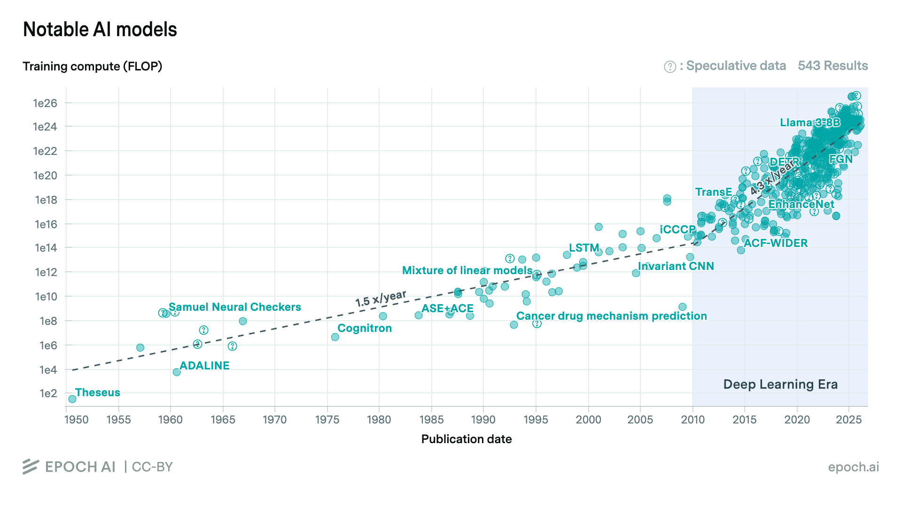

An orientation chapter. No prereqs. The goal is to turn hype into curiosity, then point that curiosity at the rest of the course.

Read this alongside `notebook.ipynb` — every hands-on section below maps to a cell you should run.

## Learning Objectives

By the end of this chapter, you will understand:

- Why LLMs suddenly became useful in late 2022 — and why the math behind them is decades old
- That a language model is one primitive: a probability distribution over the next token
- How **data**, **compute**, and the **transformer** compounded into ~9 orders of magnitude of training scale in 13 years, and what the cost / power / dataset numbers actually look like
- How to call an LLM over an OpenAI-compatible API, stream tokens, and switch between models
- What **temperature** does to the next-token distribution, and how to *see* that distribution directly via `logprobs`
- How **tool use** works under the hood: a stateless `while` loop around a chat call
- What the **system role** is and how it differs from `user` / `assistant` / `tool`
- That the chat API is a thin layer over "predict the next token from this string" — messages, tools, and roles all flatten into one token sequence via a model-specific **chat template**
- The difference between the **completions** endpoint (raw text in, text out) and the **chat completions** endpoint (messages in, message out) — and that you can apply the chat template yourself to bridge the two

---

## 1. The Moment

ChatGPT launched on **November 30, 2022**. Five days later it had **1 million users**. Two months later it had **100 million** — the fastest consumer product adoption in history ([UBS, Feb 2023](https://www.reuters.com/technology/chatgpt-sets-record-fastest-growing-user-base-analyst-note-2023-02-01/)). For comparison:

| Product   | Time to 100M users |
|-----------|--------------------|
| ChatGPT   | 2 months |
| TikTok    | 9 months |
| Instagram | 2.5 years |
| WhatsApp  | 3.5 years |
| Facebook  | 4.5 years |
| Twitter   | 5+ years |

By 2024, OpenAI was reporting **>200M weekly active users** on ChatGPT, **>$3.7B in annual revenue**, and an enterprise install base in the Fortune 500. Anthropic, Google DeepMind, Meta, Mistral, xAI, and the Chinese labs (DeepSeek, Qwen, Kimi, GLM) were all shipping frontier-class models on a roughly quarterly cadence.

**Question to sit with:** when did *you* first feel it?

---

## 2. What Is a Language Model, Really?

A function that takes some text and returns a probability distribution over what comes next.

```
"The capital of France is" → "Paris" (probability 0.87)
                            → "a"     (0.04)
                            → "the"   (0.02)
                            → "located" (0.01)
                            → ...
```

Formally, given a sequence of tokens `x₁, x₂, …, xₙ`, the model computes

```
P(xₙ₊₁ | x₁, x₂, …, xₙ)
```

over a vocabulary of typically **30,000–200,000 tokens**. (GPT-2: 50,257. Llama 3: 128,256. Gemma 2: 256,000.)

That's it. Everything else — chat, code, "reasoning," tool use, agents — is built on top of this one primitive by:

1. Training on enough text that the distribution becomes useful.
2. Sampling from it repeatedly (autoregressive generation).
3. Wrapping the input/output with conventions (chat templates, tool schemas, system prompts).

We'll build all three from scratch over the rest of the course.

---

## 3. But Language Models Aren't New

The ideas behind today's LLMs are decades old. A very compressed timeline:


| Year  | What happened | Reference |
|-------|---------------|-----------|
| 1948  | Shannon estimates the entropy of printed English at ~1.0–1.5 bits/character | ["A Mathematical Theory of Communication"](https://people.math.harvard.edu/~ctm/home/text/others/shannon/entropy/entropy.pdf) |
| 1970s | IBM's statistical speech recognition program (Jelinek, Mercer) | "Every time I fire a linguist…" *(see note below)* |
| 1986  | Backpropagation popularized for training neural nets | [Rumelhart, Hinton, Williams](https://www.nature.com/articles/323533a0) |
| 2003  | Bengio et al.: first neural language model with learned word embeddings | [JMLR](https://www.jmlr.org/papers/volume3/bengio03a/bengio03a.pdf) |
| 2010  | Mikolov: RNN language models beat n-grams on perplexity | [Interspeech](https://www.fit.vutbr.cz/research/groups/speech/publi/2010/mikolov_interspeech2010_IS100722.pdf) |
| 2013  | word2vec — words become 300-dimensional vectors that do analogy arithmetic | [Mikolov et al.](https://arxiv.org/abs/1301.3781) |
| 2017  | **"Attention Is All You Need" — the transformer (65M params, 8 GPUs, 3.5 days)** | [arXiv:1706.03762](https://arxiv.org/abs/1706.03762) |
| 2018  | GPT-1 (117M), BERT (340M); transfer learning becomes the default | [Radford](https://cdn.openai.com/research-covers/language-unsupervised/language_understanding_paper.pdf), [Devlin](https://arxiv.org/abs/1810.04805) |
| 2019  | GPT-2 (1.5B) — OpenAI initially withholds weights citing misuse risk | [blog](https://openai.com/research/better-language-models) |
| 2020  | GPT-3 (175B); the Kaplan scaling-laws paper | [arXiv:2001.08361](https://arxiv.org/abs/2001.08361), [arXiv:2005.14165](https://arxiv.org/abs/2005.14165) |
| 2022  | InstructGPT / RLHF; Chinchilla scaling laws; ChatGPT | [arXiv:2203.02155](https://arxiv.org/abs/2203.02155), [arXiv:2203.15556](https://arxiv.org/abs/2203.15556) |
| 2023  | GPT-4, Claude, Llama 1/2, the open-weights explosion | |
| 2024  | Llama 3 (8B/70B/405B), Claude 3, Gemini 1.5 with 1M-token context | |
| 2025  | Reasoning models (o1, o3, Claude 3.7, R1); multimodal becomes default | |


> **Note on Shannon Estimates — what does "1.0–1.5 bits/character" mean?** Operationally: an optimal lossless compressor that knew English perfectly would need only ~1–1.5 bits to encode each character on average, versus 8 bits for raw ASCII. Shannon's [1951 follow-up paper](https://archive.org/details/bstj30-1-50) estimated this by having humans guess the next letter of English text. It's the first time anyone put a number on "how predictable is language?" — and it's the *same* quantity a modern language model minimizes during training. Lower loss = better compressor = better predictor. **Prediction is compression.** For reference: gzip gets ~2.5–3 bits/char, xz ~2, and modern neural compressors like `nncp` and `cmix` reach **~0.8 bits/char** — actually beating Shannon's human estimate, because modern LMs predict English better than his 1951 test subjects did.

> **Note on "Every time I fire a linguist…"** The line is usually attributed to **Fred Jelinek**, the IBM speech-recognition pioneer, and it captures a real methodological shift. Early NLP/speech systems leaned on hand-built linguistic rules: experts encoded pronunciation, grammar, exceptions, and special cases by hand. Jelinek's IBM group pushed the opposite idea — instead of telling the machine the rules, let it learn probabilities from large amounts of data. That work helped establish n-gram language models and the broader statistical turn in speech and language processing. As those statistical systems improved, the joke was that whenever a linguist left and their rule-based "help" stopped shaping the system, the recognizer got better. It was not really an attack on linguists as people so much as a jab at a methodology: at that time, for that task, empirical models were beating handcrafted theory. The exact wording and original occasion are unclear, fitting its status as a legendary lab anecdote. The [National Academy of Engineering](https://www.nae.edu/189634/FREDERICK-JELINEK-19322010) records a variant: *"Every time I fire a linguist, my payroll goes down and the performance of my speech recognizer goes up."*

The core architecture — the transformer — dates to 2017. But a lot *around* it has changed: data curation, post-training (RLHF, DPO), inference optimization, long-context methods, tool-use scaffolding, multimodality. The breakthrough wasn't one idea — it was everything compounding at once.

---

## 4. What Actually Changed?

Three things compounded:

1. **Data** — the public web gave us trillions of tokens of text.
2. **Compute** — GPUs got roughly **1000× cheaper per FLOP** between 2012 and 2024 ([Epoch AI, 2023](https://epoch.ai/blog/trends-in-gpu-price-performance)).
3. **Algorithm** — the transformer parallelizes across the sequence dimension, and empirically, training loss improves as a smooth power law when you increase data and parameters (though compute, memory, and data quality constraints mean scaling is far from trivial in practice).



*Source: [Epoch AI](https://epoch.ai/data/ai-models/)*

<div style="overflow-x: auto;">

| Model | Year | FLOPs | Tokens | Power | Cost (2023 $) | Train time | Confidence |
|-------|------|-------|--------|-------|---------------|------------|------------|
| AlexNet | 2012 | 4.7 × 10¹⁷ | 2B | — | $16 | 6 d | Reported |
| GPT-2 (774M) | 2019 | 5 × 10²¹ | 11B | — | $19K | — | Reported |
| GPT-3 175B | 2020 | 3.1 × 10²³ | 238B | 5 MW | $2M | 15 d | Reported |
| PaLM 540B | 2022 | 2.5 × 10²⁴ | 780B | 4 MW | $3M | 64 d | Reported |
| GPT-4 | 2023 | 2.1 × 10²⁵ | 5.4T | 20 MW | $37M | 95 d | Estimated |
| Llama 3.1-405B | 2024 | 3.8 × 10²⁵ | 15.6T | 23 MW | $53M | 89 d | Reported |
| Grok 3 | 2025 | 3.5 × 10²⁶ | — | 110 MW | $218M | 90 d | Estimated |
| Grok 4 | 2025 | 5 × 10²⁶ | — | — | $388M | — | Speculative |

</div>

*Confidence reflects Epoch AI's classification. "Reported" = published by the lab. "Estimated" = derived from public details. "Speculative" = rough estimates from indirect signals.*

That's **~9 orders of magnitude in 13 years** of training compute. From AlexNet (2012, $16, one bedroom GPU) to Grok 4 (2025, ~$388M, a power plant). Frontier training compute has been growing at roughly **4–5× per year** since 2010 ([Sevilla et al., 2022](https://arxiv.org/abs/2202.05924)).

A few reference points to anchor the numbers:

- **A single H100** does ~10¹⁵ FLOP/s (FP16). Training GPT-4 at 2.1 × 10²⁵ FLOPs would take **~665 GPU-years** at 100% utilization — that's why the real runs use **thousands of GPUs in parallel for ~95 days**.
- **A nuclear reactor** outputs ~1 GW. Grok 3 drew 110 MW — about 11% of one full reactor, continuously, for three months.
- **Wikipedia** is ~4B tokens. GPT-4's training set (5.4T tokens) is **~1,350 Wikipedias**. Llama 3.1 (15.6T) is ~3,900.
- **A human reads** ~250 words/min ≈ 5.5 tokens/sec (OpenAI's rule of thumb: 1 token ≈ 0.75 words). Reading 15.6T tokens at that rate takes **~90,000 years** of nonstop reading.

**None of these alone would have worked. All three together = the moment.**

The seminal scaling-laws results:

- **Kaplan et al. (2020):** loss is a smooth power law in compute, dataset size, and parameter count, over 7+ orders of magnitude. ([arXiv:2001.08361](https://arxiv.org/abs/2001.08361))
- **Hoffmann et al. / Chinchilla (2022):** for a given compute budget, you want roughly **20 tokens per parameter**. Most models before 2022 were dramatically under-trained. ([arXiv:2203.15556](https://arxiv.org/abs/2203.15556))

*Data sources for the table: Epoch AI, [epoch.ai/data/notable-ai-models](https://epoch.ai/data/notable-ai-models). Some entries are estimates marked "Likely" or "Speculative" by Epoch.*

---

## 5. Setup — OpenRouter

For the hands-on parts we use **[OpenRouter](https://openrouter.ai)**: one API key, ~300 models from ~60 providers, free and paid. It's OpenAI-compatible, so any OpenAI SDK works.

1. Sign up at [openrouter.ai](https://openrouter.ai) — it's free.

2. Create an API key at [openrouter.ai/keys](https://openrouter.ai/keys).

3. In `chapters/1/`, copy `.env.example` to `.env` and paste your key:

    ```bash
    cp .env.example .env
    # then edit .env and replace the placeholder with your real key
    ```

4. Open `notebook.ipynb` and run the setup cell.

`.env` is gitignored. Your key never gets committed or appears on screen.

Why OpenRouter and not the OpenAI/Anthropic SDKs directly?

- **One key, many providers.** Switch between GPT-4o, Claude, Llama, DeepSeek, Qwen with a string change.
- **Free tier.** Several capable models (Llama 3.x, Qwen, Mistral) are free with rate limits.
- **OpenAI-compatible.** Everything you learn here transfers directly to the official SDKs.

### What is the "OpenAI SDK," and why does pointing it at OpenRouter just work?

The `openai` Python package is **a thin HTTP client**. When you call `client.chat.completions.create(...)`, it sends a `POST` request to `/v1/chat/completions` with your messages as JSON, parses the response, and (for streaming) handles Server-Sent Events. You could replace it with a few lines of `requests` or `curl` and get the exact same JSON back — the SDK exists so you don't have to manage retries, schemas, and SSE parsing yourself.

The reason you can point it at `https://openrouter.ai/api/v1` and have it talk to Claude, Llama, Qwen, DeepSeek, and others is that **"OpenAI-compatible" became the de facto API standard** around 2023. OpenRouter, Together, Groq, Fireworks, Anyscale, vLLM, Ollama, and llama.cpp's built-in server all implement the same `/v1/chat/completions` endpoint shape that OpenAI defined. So one client, one set of conventions, dozens of backends. Anthropic and Google still have their own native SDKs with extra features (Anthropic's `system` as a top-level field, Google's safety settings), but the OpenAI-compatible shape is the lingua franca.

Concretely, the only line that changes between "talk to OpenAI" and "talk to OpenRouter" is the `base_url`:

```python
client = OpenAI(base_url="https://openrouter.ai/api/v1", api_key=...)
```

The core fields — `messages`, `tools`, `temperature`, `stream`, `logprobs` — look the same across providers. Details around tool schemas, response formats, multimodal inputs, rate limits, and edge-case behavior do vary, but for this course the common subset is all we need.

---

## 6. Hands-on: Hello, LLM

→ **Notebook Exercise 1.** Call a free model and a paid model with the same prompt.

Things to notice:

- **Latency.** Time-to-first-token is usually 200ms–2s; total time depends on output length.
- **Streaming.** Tokens arrive one at a time over Server-Sent Events. The model isn't "thinking and then answering" — it's emitting tokens as it computes them.
- **Throughput.** Frontier models on big providers do ~50–100 tokens/sec. Some specialized inference providers (Groq, Cerebras) hit **500–2000 tok/s** on smaller open-weights models.
- **Quality differences.** A 7B free model and a 1T+ frontier model are not in the same league, but the gap on simple tasks is smaller than you'd expect.

---

## 7. Hands-on: Same Prompt, Different Models

→ **Notebook Exercise 2.** Loop one prompt through several models.

**Predict first.** Which model is clearest? Most verbose? Most wrong?

The course's audience speaks Arabic, so we use Arabic prompts as a stress test for multilingual quality. Most models are trained on **>90% English** data; non-English performance varies wildly. As of 2025, models that tend to perform well on multilingual benchmarks include Claude, GPT-4o, Gemini, and Qwen (Qwen explicitly targets Chinese + multilingual) — though rankings vary by language, task, and benchmark. Smaller English-centric models often degrade noticeably on Arabic, especially on dialect.

---

## 8. It's Just Probabilities → Temperature

Every token is sampled from a distribution. **Temperature** rescales that distribution before sampling, by dividing the logits by `T`:

```
P(token) = softmax(logits / T)
```

- `T → 0` → the softmax becomes a hard argmax. (Almost) always pick the most likely token.
- `T = 1` → use the model's raw distribution.
- `T → ∞` → flatten toward uniform. Pick anything.

In practice:

- `T = 0.0–0.3` → factual / code / structured output.
- `T = 0.7–1.0` → conversational, creative writing.
- `T = 1.2–1.8` → brainstorming, deliberate weirdness. Often incoherent past ~1.5.

→ **Notebook Exercise 3.** Run the same prompt at `T = 0`, `0.7`, `1.5`. **At what temperature does it break?**

Related sampling knobs you'll see in APIs:

- **`top_p`** (nucleus sampling, [Holtzman et al. 2019](https://arxiv.org/abs/1904.09751)): keep only the smallest set of tokens whose cumulative probability ≥ p, then renormalize.
- **`top_k`**: keep only the k highest-probability tokens.
- **`frequency_penalty` / `presence_penalty`**: discourage repetition.
- **`repetition_penalty`** (HF, not OpenAI): same idea, multiplicative.

Most frontier APIs default to `top_p = 1.0` and rely on temperature alone.

---

## 9. Seeing the Distribution

Remember Section 4? `P("Paris" | ...) = 0.87` was just an abstraction. Now we look at the real numbers.

The OpenAI-style API can return `logprobs=True, top_logprobs=5`: for every generated token, the actual log-probability the model assigned, plus its top-5 alternatives.

→ **Notebook Exercise 3 (logprobs cell).** For each temperature, print a table — `token | prob | top-5 alternatives`.

What to look for:

- **T = 0**: the chosen token's prob is usually >0.5, often >0.9. The top-5 alternatives are tiny.
- **T = 0.7**: chosen prob lower. Alternatives are competitive (10–30%).
- **T = 1.5**: model often picks a token outside the top-5 of low-T runs. *That's* what flattening means.

**Aside on "deterministic":** even at `T = 0` the model occasionally doesn't pick the top token. Causes:

- **GPU non-determinism.** Floating-point reductions (sums) depend on order, and CUDA kernels reorder for parallelism.
- **Batching.** Your request gets batched with other users'; the kernel paths differ by batch shape.
- **Default `top_p` < 1**, or default `seed` not pinned.
- **Speculative decoding.** A draft model proposes tokens, the main model verifies — in some implementations this introduces tiny rounding differences.

Deterministic behavior in real serving systems is fragile unless you tightly control the entire stack — fixed seeds, pinned batch sizes, deterministic kernels ([He et al., 2025, Thinking Machines](https://thinkingmachines.ai/blog/defeating-nondeterminism-in-llm-inference/)). A useful first lesson: reproducibility is something you have to fight for, not something you get for free.

---

## 10. Context Windows

The model sees a fixed window of tokens. Past that, it's gone — the API will either truncate or error.

Context windows have grown rapidly:

- **GPT-2 (2019):** 1,024 tokens
- **GPT-3 (2020):** 2,048
- **GPT-3.5 (2022):** 4,096 → later 16K
- **GPT-4 (2023):** 8K → 32K → 128K
- **Claude 2 (2023):** 100K
- **Claude 3.5 / 4 (2024–25):** 200K (1M for some enterprise tiers)
- **Gemini 1.5 Pro (2024):** **1M** (10M demoed)
- **Llama 4 / GPT-4.1 (2025):** 1M+

But "supports 1M tokens" ≠ "uses 1M tokens well." The "[needle in a haystack](https://github.com/gkamradt/LLMTest_NeedleInAHaystack)" benchmark shows recall degrades meaningfully past ~50% of the advertised window for most models. And naive self-attention is **O(n²)** in sequence length — in theory, a 1M-token prompt would need ~1,000,000× the FLOPs of a 1,000-token one. In practice, optimized implementations (FlashAttention, ring attention, sparse/linear attention variants) reduce this dramatically, but cost still grows super-linearly. Long contexts are expensive.

---

## 11. Hallucinations

The model is trained to sound right, not to be right. Its loss function — next-token cross-entropy on web text — rewards plausibility, not truth.

→ **Notebook Exercise 5.** Invent a fake term, ask for a real citation about it. The model will confidently make one up.

Some rough numbers:

- The infamous [Mata v. Avianca](https://en.wikipedia.org/wiki/Mata_v._Avianca,_Inc.) case (June 2023): a lawyer submitted a brief with **6 fabricated case citations** generated by ChatGPT. The judge sanctioned both lawyers and their firm $5,000.
- On medical Q&A, [studies](https://www.nature.com/articles/s41746-023-00873-0) put fabrication rates at **5–20%** depending on the model and prompt.
- Even GPT-4 fabricates citations on academic-lookup tasks at rates that vary widely by domain and prompting strategy. The point is that even frontier models confidently invent sources unless grounded with retrieval.

Mitigations (we'll touch some of these later):

- **Retrieval-augmented generation (RAG):** ground the model in a real document store.
- **Tool use:** let the model look things up rather than recall them.
- **Temperature 0 + structured output:** doesn't fix hallucination but reduces variance.
- **Verification / self-consistency:** ask multiple times, vote.
- **Fine-tuning on "I don't know"** examples — surprisingly hard.

**Discussion:** why does this happen? What would you actually need to fix it?

---

## 12. Tool Use — One Call

Modern models can ask the program to call a function. This is how Claude Code, ChatGPT plugins, Cursor, and "agents" work under the hood.

The pattern was standardized by OpenAI's June 2023 [function-calling release](https://openai.com/index/function-calling-and-other-api-updates/) and is now supported by Anthropic, Google, Mistral, Llama 3+, Qwen, and most open-weights models. Anthropic released its [Model Context Protocol (MCP)](https://modelcontextprotocol.io) in November 2024 to standardize how tools are exposed across clients.

→ **Notebook Exercise 6 (first cell).** Send a `tools=[...]` definition. Look at the raw response — instead of `content`, you get `tool_calls`.

The model isn't *running* the function. It's saying *"please run this and tell me the result."* The actual execution happens in your code.

---

## 13. Tool Use — The Orchestration Loop

One call isn't enough. The real pattern is a loop:

```
1. send messages + tools to the model
2. if response has tool_calls:
     run each tool, append result as role="tool"
     loop back to step 1
3. else:
     done — print final answer
```

→ **Notebook Exercise 6 (orchestration cell).** Compare weather between Cairo and NYC. Watch the request body grow each turn. Two tool calls, then a final answer.

→ **Notebook Exercise 6b.** A prayer time assistant with **two different tools**: `get_current_time(city)` and `get_prayer_times(city, date)`. The model must call the first to learn the current time, extract the date from that result to call the second, then reason about which prayer is next and calculate the time remaining — all without being told how. This is a better illustration of multi-tool chaining because the tools are different (not the same tool called twice) and the final answer requires arithmetic the model does on its own.

Three things this exercise makes concrete:

1. **The API is stateless.** You re-send the entire history every turn. The "conversation" lives in your client code, not on the server.
2. **An "agent" is just a `while` loop** around a tool-augmented chat call. Claude Code, Cursor, AutoGPT, LangGraph — strip the abstractions away and the kernel is this loop.
3. **Token cost compounds with turns.** Every turn re-sends all prior turns plus the tool schemas, so total input tokens grow roughly like 1+2+3+…+n. A 10-turn conversation can easily use 5–10× more input tokens than 10 independent calls.

---

## 14. The System Role

Every message has a `role`. So far we've used `user`. There's also:

- **`system`** — instructions for the whole conversation, set by you, not by the user. Persona, rules, constraints.
- **`user`** — the human's input.
- **`assistant`** — the model's previous responses (re-sent so the model "remembers").
- **`tool`** — the result of a tool call (only valid as a reply to an assistant `tool_calls` message).

Anthropic's API treats `system` as a separate top-level field rather than a message; OpenAI treats it as the first message in the list. Same idea, different shape.

→ **Notebook Exercise 7.** Same physics question, two system prompts (formal tutor vs pirate). Watch the persona change.

---

## 15. What Does the Model Actually See?

You've been sending JSON: `[{"role": "system", ...}, {"role": "user", ...}, tools=[...]]`.

The model has never seen JSON. It sees **one string of tokens**.

The API flattens your messages using a model-specific **chat template**, then tokenizes. Every model family has its own template — different special tokens, different role markers, different way of encoding tools. A few examples:

**Llama 3:**
```
<|begin_of_text|><|start_header_id|>system<|end_header_id|>
…<|eot_id|>…
```

**Qwen**
```
<|im_start|>system\n…<|im_end|>
<|im_start|>user\n…<|im_end|>
```

**Gemma:**
```
<start_of_turn>user\n…<end_of_turn>
<start_of_turn>model\n
```

**Mistral Instruct:**
```
[INST] … [/INST]
```

If you send a message in the wrong template, the model often still answers — but less well. Quality is meaningfully worse, and tool calling tends to break entirely. HuggingFace's [`apply_chat_template`](https://huggingface.co/docs/transformers/main/en/chat_templating) reads the template from the tokenizer config (`tokenizer_config.json`) so each model formats correctly.

→ **Notebook Exercise 8.** Load the `gpt-oss-20b` tokenizer, call `apply_chat_template`, print the raw prompt string.

**This is the moment** the abstraction breaks. The chat API is a thin layer on top of "predict the next token from this string."

---

## 16. Tools in the Raw Prompt

Tools aren't a separate channel either. They get serialized into the same string, in whatever format the model was trained on (JSON Schema, TypeScript-style signatures, XML — every family is different).

→ **Notebook Exercise 8 (tools cell).** Apply the template with `tools=[...]`. Most of the tokens in the prompt are the tool schema, not the user question.

This explains a lot:

- **Why tool definitions cost tokens.** A single tool with a 5-field schema is often 200–500 tokens before any conversation starts. Ten tools = 2,000–5,000 tokens of overhead per turn.
- **Why different models support tools differently.** A model fine-tuned on JSON-Schema-style tool calls won't be great at TypeScript-style ones, and vice versa.
- **Why prompt engineering for tools matters.** Description text inside the schema is real input the model reads — write it like documentation.

---

## 17. Text Completion (not Chat)

Everything above used the **chat** endpoint (`/v1/chat/completions`), which expects structured messages with roles. But there's an older, simpler API: the **completions** endpoint (`/v1/completions`). It takes a raw string and continues it — pure next-token prediction with no roles, no system prompt, no template.

The chat endpoint applies a template behind the scenes (as we just saw). The completions endpoint does **no wrapping at all** — your string is tokenized and fed directly to the model. You control every token.

This is how **GitHub Copilot** works: you type half a function, and the model completes the rest. Chat formatting would just get in the way.

→ **Notebook Exercise 9.** Send a partial Python function and a partial English sentence through the completions endpoint. Watch the model continue both — no roles, no instructions, just raw next-token prediction.

---

## 18. Chat via the Completions Endpoint

What if you want to use a **chat-tuned** model (one post-trained to follow instructions) through the completions endpoint?

You apply the chat template yourself using `tokenizer.apply_chat_template`, then send the resulting string through `/v1/completions`. This gives you the best of both worlds: the model responds as an assistant (because it sees the template it was trained on), but you have full control over the raw prompt.

Why would you do this? The completions endpoint gives you things the chat endpoint sometimes doesn't — like logprobs on every token, or the ability to provide a partial assistant response and let the model continue from there (prefix-constrained generation).

→ **Notebook Exercise 10.** Apply the chat template for both Qwen and gpt-oss-20b, send the formatted strings through `/v1/completions`, and compare with the chat endpoint. The outputs should match — proving that the chat API is just template + completion under the hood.

This also reveals how different model families bake different things into their templates. Qwen's is clean (`<|im_start|>system\n...<|im_end|>`). gpt-oss-20b's injects a hardcoded identity (`"You are ChatGPT..."`), remaps `system` to `developer`, and includes internal reasoning channels (`analysis`, `final`) — all invisible when you use the chat endpoint, but fully exposed through completions.

---

## Summary

- **The moment** in late 2022 wasn't a new idea — it was scale. Data, compute, and the transformer all hit at once. ChatGPT to 100M users in 2 months.
- **A language model is one primitive**: a probability distribution over the next token, given the previous ones. Everything else (chat, tools, "reasoning," agents) is built on top.
- **9 orders of magnitude** in training compute over 13 years. Frontier training compute grows ~4–5×/year. Cost grew from $16 (AlexNet, 2012) to $388M (Grok 4, 2025).
- **Scaling laws** (Kaplan 2020, Chinchilla 2022) make this growth a *prediction*, not a hope: loss is a smooth power law in compute, parameters, and data.
- **Temperature** rescales the next-token distribution. **Logprobs** let you *see* that distribution directly. "Deterministic" inference at scale is a myth — even at T=0.
- **Context windows** went from 1K (GPT-2) to 1M+ (Gemini, GPT-4.1) in 6 years, but recall degrades long before the limit, and attention is O(n²).
- **Hallucinations** happen because the loss rewards plausibility, not truth. Mitigations: retrieval, tools, verification — none perfect.
- **The API is stateless.** You re-send the full history every turn. **Tool use is just a `while` loop** around that. An "agent" is the same loop with a longer leash.
- **Chat templates flatten everything** — system, user, assistant, tool schemas — into a single token string. The "messages" abstraction is cosmetic; the model only ever sees one string.
- **Two endpoints, one primitive.** The completions endpoint (`/v1/completions`) takes raw text and continues it — this is what Copilot uses. The chat endpoint (`/v1/chat/completions`) applies a template first, then does the same thing. You can apply the template yourself and use completions directly, which reveals what the chat API hides (hardcoded identities, reasoning channels, role remapping).
- The rest of the course rebuilds every piece you touched today, starting from counting words in Shakespeare.

---

## Discussion Questions

1. You just saw the raw prompt string the model receives. Did anything about it surprise you?
2. If the model is just predicting the next token, how does it "reason"? How does it "use a tool"?
3. Where should you **not** use an LLM? What failure modes did we see today?
4. The orchestration loop for tool use is just a `while`. Why does this feel like an agent?
5. Compute has grown 4–5× per year for a decade. How many more years can that continue? What runs out first — money, electricity, chips, or data?
